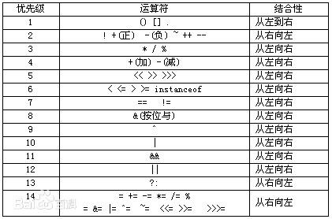

```C
team_struct team =
{
   // teamname:
   "518431910002"
    ,
   // name1:
   "KANG Yixiao"
   ,
   // id1:
   "518431910002"
   ,

   /* The following should only be changed if there are two team members */
   /* Student name 2: Full name of the second team member */
   "",
   /* Login ID 2: Login ID of the second team member */
   ""
};
```

```C
int bang(int x) {
  x = x|(x>>1);
  x = x|(x>>2);
  x = x|(x>>4);
  x = x|(x>>8);
  x = x|(x>>16);
  int y = x &(0x1);
  return y;
}
/*
 * bitCount - returns count of number of 1's in word
 *   Examples: bitCount(5) = 2, bitCount(7) = 3
 *   Legal ops: ! ~ & ^ | + << >>
 *   Max ops: 40
 *   Rating: 4
 */
int bitCount(int x) {
/*
 * devide 8 bits into 2 group,use mask and >> to get the total number of 1 ofevery group,then add the 2 number.   
 */
  int m1 = 0x11 | (0x11 << 8);
  int mask = m1 | (m1 << 16);
  int s = x & mask;
    s += x>>1 & mask;
    s += x>>2 & mask;
    s += x>>3 & mask;

  /* Now combine high and low order sums */
  s = s + (s >> 16);
  /* Low order 16 bits now consists of 4 sums.
  Split into two groups and sum */
  mask = 0xF | (0xF << 8);
  s = (s & mask) + ((s >> 4) & mask);
  return (s + (s>>8)) & 0x3F;
  }
```

ABS

```C
1)对于代码
         temp = temp >> 31;
         out = out ^ temp;
         out = out - temp;
如果iNum是正数：
         temp = temp >> 31; //temp = 0
         out = out ^ temp; //与0异或不变
         out = out - temp; //减0不变
 
out的结果就是iNum，即正数的绝对值是其本身，没问题
 
如果iNum是负数:
         temp = temp >> 31; //temp = oxffffffff
         out = out ^ temp; //out为iNum求反
         out = out - temp; // 此时temp = 0xffffffff = -1, 所以out = out + 1
```


find the most significant byte

```C++
// CPP program to find MSB number for given n. 
#include <iostream> 
using namespace std; 

int setBitNumber(int n) 
{ 
	// Below steps set bits after 
	// MSB (including MSB) 

	// Suppose n is 273 (binary 
	// is 100010001). It does following 
	// 100010001 | 010001000 = 110011001 
	n |= n >> 1; 

	// This makes sure 4 bits 
	// (From MSB and including MSB) 
	// are set. It does following 
	// 110011001 | 001100110 = 111111111 
	n |= n >> 2; 

	n |= n >> 4; 
	n |= n >> 8; 
	n |= n >> 16; 

	// Increment n by 1 so that 
	// there is only one set bit 
	// which is just before original 
	// MSB. n now becomes 1000000000 
	n = n + 1; 

	// Return original MSB after shifting. 
	// n now becomes 100000000 
	return (n >> 1); 
} 

// Driver code 
int main() 
{ 
	int n = 273; 
	cout << setBitNumber(n); 
	return 0; 
} 


```


https://stackoverflow.com/questions/18806481/how-can-i-get-the-value-of-the-least-significant-bit-in-a-number?answertab=active#tab-top


### 表示条件

```c++
//int codition =0 or 1，if condition ->B else ->C
mask_condition = condition >> 31;//右移31位也可产生31个1
mask_condition & B |~ mask_condition & c
```


位操作符优先级




abs 

```c++
int absVal(int x)  // 4 ops
{
    int neg_mask = x >> 31;

    // Return x if x is nonnegative else ones' complement + 1 (two's complement)
    return (x ^ neg_mask) + (neg_mask & 1);
}
```

